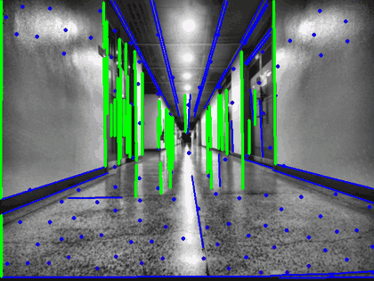
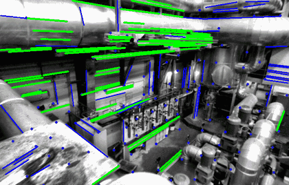
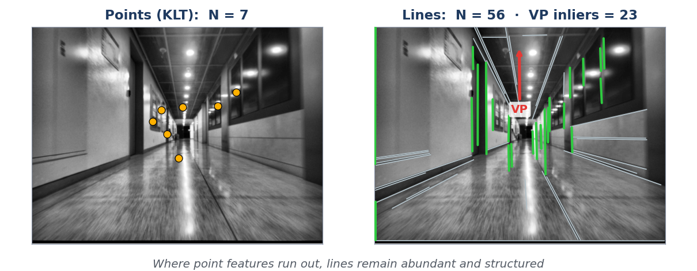

<p align="center">
  <h1 align="center"><a href="https://arxiv.org/abs/2609.21186"><ins>SLIM-init</ins></a> :triangular_ruler: @IROS2026</h1>
  <h2 align="center">Robust Structureless Monocular Visual-Inertial Initialization<br>Exploiting Line Features and Vanishing Points</h2>
  <p align="center">
    Junwan Choi
    ·
    Woongrae Jo
    ·
    Dong-Uk Seo
    ·
    Jinwoo Jeon
    ·
    Hyun Myung
  </p>
</p>

<p align="center">
  <a href="https://arxiv.org/abs/2609.21186"></a>
  <a href="./LICENSE"></a>
  
  
  
  
</p>

<p align="center">
     
    <br>
    <em>Live front-end on a degenerate corridor (left) and on EuRoC MH_01 (right).<br>
    Grey: detected lines &nbsp;·&nbsp; Blue: matched lines &nbsp;·&nbsp; Green: assigned to the dominant vanishing point<br>
    Dots: tracked points, red as the track ages</em>
</p>

## :open_book: Table of Contents

- [About SLIM-init](#bookmark_tabs-about-slim-init)
- [Prerequisites](#wrench-1-prerequisites)
- [Build](#hammer-2-build)
- [Dataset](#file_folder-3-dataset)
- [Run](#zap-4-run)
- [Docker](#whale-5-docker)
- [Acknowledgements](#pray-6-acknowledgements)
- [Citation](#memo-7-citation)
- [License](#balance_scale-8-license)

## :bookmark_tabs: About SLIM-init

* A **structureless** monocular visual-inertial initializer: no triangulation, no 3D map :straight_ruler:
* Lines are used as **constraints**, not as landmarks, so the state vector stays compact.
* :compass: A dominant **vanishing point is invariant to translation**, which turns it into a pure rotation cue for gyroscope bias estimation.
* :triangular_ruler: **Line epipolar** and **line-normal projection** residuals pin down the directions that point parallax leaves ambiguous.
* :zap: **4.1 ms** per initialization and **0.110 m** pose RMSE on EuRoC — the fastest solve and the lowest error among the four methods compared in the [paper](https://arxiv.org/abs/2609.21186), and it holds up under low parallax, translation-dominant motion and textureless scenes.

<p align="center">
    
    <br>
    <em>One frame of a corridor walk: only 7 point tracks survive into the solver, against 56 detected lines,<br>23 of which agree on a single dominant vanishing point.</em>
</p>

## :wrench: 1. Prerequisites

Tested on Ubuntu 18.04 (GCC 7), 20.04 (GCC 9) and 22.04 (GCC 11), with CMake >= 3.10.

* **Eigen** >= 3.3
* **Ceres Solver** >= 1.14 (tested with 1.14 and 2.0)
* **OpenCV** >= 4.5.2, built with [opencv_contrib](https://github.com/opencv/opencv_contrib) —
  the line tracker needs `ximgproc` (EdgeDrawing) and `line_descriptor`

Boost headers and glog are also required, and both usually come along with Ceres.
Sophus is bundled in `thirdparty/`. A Docker recipe with all dependencies is
provided in [docker/](docker/) (see section 5).

## :hammer: 2. Build

```bash
git clone https://github.com/cjunwan/SLIM-init.git
cd SLIM-init
mkdir -p build && cd build
cmake ..
make -j$(nproc)
```

This produces the executable `build/run_euroc`.

## :file_folder: 3. Dataset

The driver reads datasets in the EuRoC / ASL folder layout:

```
<data_path>/
├── cam0/
│   ├── data.csv
│   └── data/*.png
├── imu0/
│   └── data.csv
└── state_groundtruth_estimate0/
    └── data.csv
```

Download the [EuRoC MAV dataset](https://projects.asl.ethz.ch/datasets/doku.php?id=kmavvisualinertialdatasets)
(ASL format) and point `data_path` in the config file to the `mav0/` directory of a sequence.
Ground truth is required for the evaluation metrics.

## :zap: 4. Run

```bash
cd build
./run_euroc ../config/euroc.yaml MH_01
```

* `config/euroc.yaml` holds the dataset path, camera / IMU calibration and all
  method parameters (line tracker, line and vanishing-point residual weights,
  window gating). The file is commented; copy and edit it for other sequences
  or sensors.
* The second argument is only a tag for the result file.
* Set `show_track: 1` in the config to display tracked points (colored by track
  length), lines (grey: detected, blue: matched, green: assigned to a vanishing
  point) and vanishing points (yellow) in an OpenCV window.

The driver slides a window over the sequence and initializes each window of 10
keyframes independently. Per-window errors against ground truth (scale, pose,
gravity direction, velocity, gyroscope bias) and the summary statistics over the
sequence are written to `<output_path>/slim_init_<tag>.txt`, which defaults to
`result/`.

## :whale: 5. Docker

```bash
./docker/build_docker.sh                 # builds the image slim-init:latest
./docker/run_docker.sh /path/to/datasets # mounts the repo at /workspace/slim-init and the datasets at /datasets
```

Inside the container build as in section 2. To use the `show_track` window,
run `xhost +local:docker` on the host first (the run script does this for you).

## :pray: 6. Acknowledgements

* [DRT-VIO-Init](https://github.com/boxuLibrary/drt-vio-init) (He et al., CVPR 2023): the
  rotation-translation-decoupled initialization that this work builds on. Large
  parts of the IMU preintegration, feature management and evaluation code come
  from that repository.
* [VINS-Mono](https://github.com/HKUST-Aerial-Robotics/VINS-Mono) and
  [camodocal](https://github.com/hengli/camodocal): point feature tracker and
  camera models.

If you use this code, please also cite DRT-VIO-Init:

```bibtex
@InProceedings{He_2023_CVPR,
    author    = {He, Yijia and Xu, Bo and Ouyang, Zhanpeng and Li, Hongdong},
    title     = {A Rotation-Translation-Decoupled Solution for Robust and Efficient Visual-Inertial Initialization},
    booktitle = {Proceedings of the IEEE/CVF Conference on Computer Vision and Pattern Recognition (CVPR)},
    year      = {2023},
    pages     = {739-748}
}
```

## :memo: 7. Citation

```bibtex
@InProceedings{choi2026slim_init,
    author    = {Choi, Junwan and Jo, Woongrae and Seo, Dong-Uk and Jeon, Jinwoo and Myung, Hyun},
    title     = {Robust Structureless Monocular Visual-Inertial Initialization Exploiting Line Features and Vanishing Points},
    booktitle = {IEEE/RSJ International Conference on Intelligent Robots and Systems (IROS)},
    year      = {2026}
}
```

## :balance_scale: 8. License

The source code is released under the [GPLv3](LICENSE) license, following DRT-VIO-Init.
